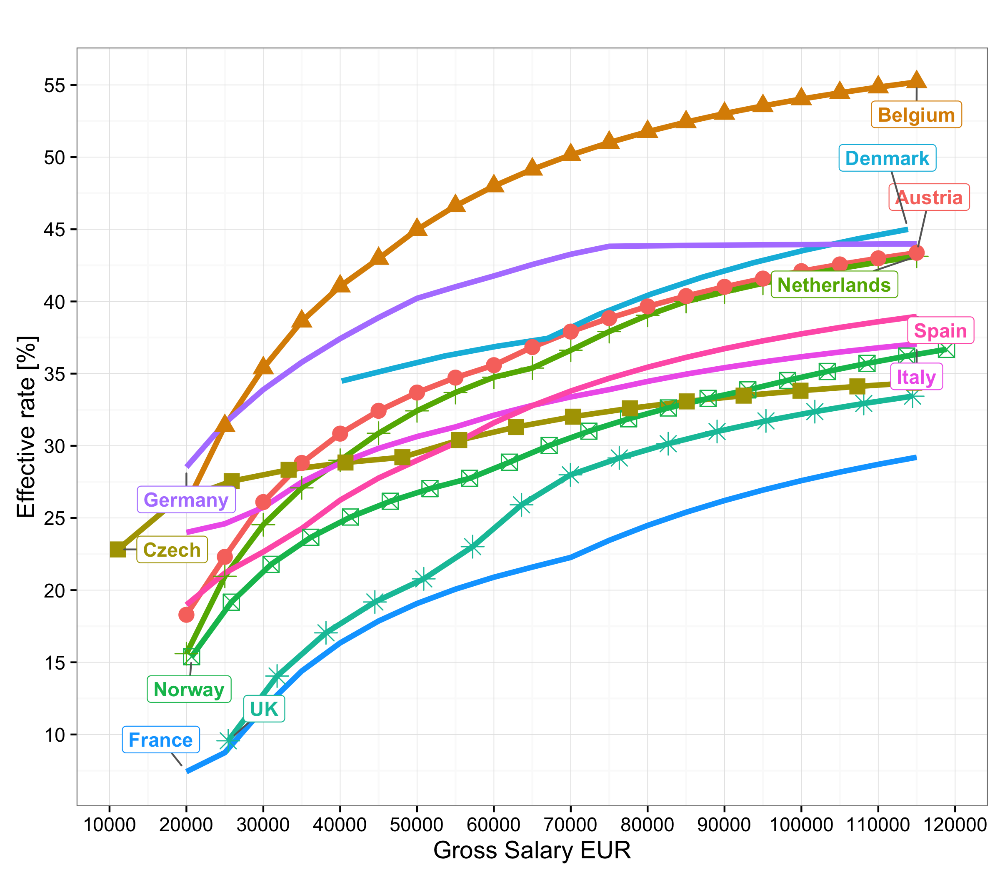

# Living Expenses Comparison

Compare the living cost, salaries and taxes across several countries

# Functionality

Currently there is no way to autmatically grab the necessary data, but if you save it to a csv file you can:

- Compare salaries between different countries (in a currency of your choice)
- Compare expenses between countries and their cities
- Calculate an expense model that involves: rent, utilities, food, transport, eating & drinking out
- Match the expense model for that city/country with the expeted salaries and see where you will be "better" payed
- Compare the tax rates of different countries (see the plot bellow)

---

## History

This project began as a small R script that was supposed to help me figure out different salaries and expenses across several countries and industries.
It soon started to grow, invlving online questionaires and polls and data science. I then wrote a series of articles on Medium:
https://medium.com/@nedjalkov.ivan.j/living-expenses-salaries-with-data-738ab830d03b

The next logical step was to make this porject public and help others quantify their job seeking experience. 

## Future goal

- Collect data on as many countries as possible
- Shinny app where people can compare only the data they want
- Paper describing some of the findings

## TODOs

- Automatically fetch currency data
- Crawl web pages to gather salaries/expenses data

---

## Example

